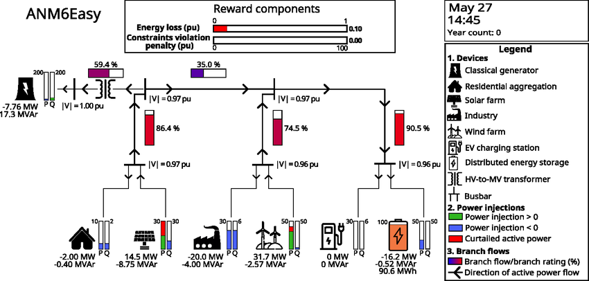

# Decision Transformer for ISO Energy Management

Eyal Amdur, Be'ery Zitelny


## Overview

Compare Decision Transformers
performance vs. classic RL in power system control problems.

ANM6Easy enviroment:



For more context, see [DT Background](BACKGROUND.md).

## Instructions

We provide code in `src` directory.
scripts should be run from the respective directories.
It may be necessary to add the respective directories to your PYTHONPATH.


### Installation

We used `uv` for enviroment managment.

First, create a new environment with `uv`:

```
uv venv .venv
```

Activate the environment:

On Linux/macOS:

    source .venv/bin/activate

On Windows:

    .venv\Scripts\activate


Then, install the dependencies:

```
uv pip install -e .
```

### Example usage

#### 🤖 To train the DT model:

```
python src/decision_transformer/train/dt_train.py
```
> **Note:**  
> Make sure to choose the DT model parameters and trajectories id number to train on.

#### 🧮 To train the baseline models:

```
python src/models/train_models.py
```
> **Note:**  
> Make sure to choose the models parameters (PPO & TD3) you would like to train with.

#### 📊 Evaluation can be produced with the following:

```
python src/evaluate/evaluate.py
```

> **Note:**  
> Make sure to choose the DT model you want to check and that you have baseline models to load.

### Before Running
Make sure to configure the environment variables and paths as required by your setup before running the evaluation script.